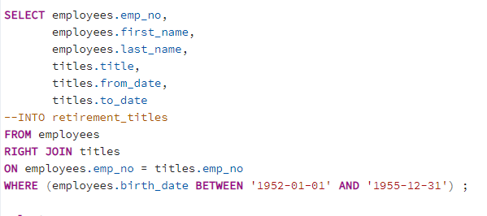

# Pewlett-Hackard-Analysis
## Overview of the analysis

### Deliverable 1: The Number of Retiring Employees by Title
- created retirement_titles table that holds all the titles of employees who were born between January 1,1952 and December 31,1955.As I want to retrieve all records with titles table I used employees table RIGHT JOIN with titles table.

 
 
- then used DISTINCT ON statement to create a table that contains the most recent title of each employee and created new table unique_titles

 

Then used the count() function to create a table that has the number of retirement-age employees by most recent job title.

Finally,because we want to include only current employees in our analysis,excluded the employees those who have already left the company.

- 
## Results
## Summery
