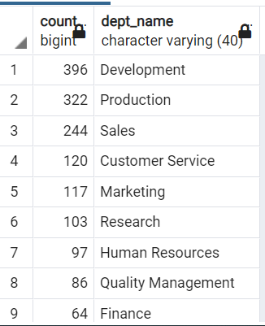

# Pewlett-Hackard-Analysis

Pewlett Hackard is a large company boasting several thousand employees and it’s been around for long time. As baby boomers begin to retire at a rapid rate Pewlett Hackard is looking toward the future in two ways. First, it’s offering retirement package for those who meet certain criteria. Second, it’s standing to think about which positions will need to be filled in near future. The number of upcoming retirements will leave thousands of job openings. What would happen to a company if they didn’t look ahead and prepare for this many vacancies? It probably wouldn’t be pretty. 

Bobby is an up-and-coming HR Analyst whose task is to perform employee research. Specifically, he needs to find answers to the following questions, who will be retiring in the next few years, and how many positions will Pewlett Hackard need to fill? This analysis will help future-proof Pewlett Hackard by generating a list of all employees eligible for the retirement package. The employee data Bobby needs is only available in the format of six CSV files because Pewlett Hackard has been mainly using Excel and VBA to work with their data. But now they’ve finally decided to update their methods and instead use SQL, a definite upgrade considering the amount of data.

I worked with Bobby to build an employee database with SQL by applying my data modelling, engineering and analysis skills. Then provided lists that are more specific.

01.	Employee Information: A list of employees containing their unique employee number, their last name, first name, gender, and salary
02.	Management: A list of managers for each department, including the department number, name, and the manager's employee number, last name, first name, and the starting and ending employment dates
03.	Department Retirees: An updated current_emp list that includes everything it currently has, but also the employee's departments
04.	Created a tailored list for sales and another tailored list for both Sales and Development teams. 

After completing above tasks Bob and my self has been given other assignments to determine the number of retiring employees per title and identify employees who are eligible to participate in a mentorship program.
Finally, complied a report that summarize my analysis and helps prepare Bobby’s manager for the “silver tsunami“ that many current employees reach retirement age.

## Overview of the analysis

## Results

### Deliverable 1: The Number of Retiring Employees by Title
created retirement_titles table that holds all the titles of employees who were born between January 1,1952 and December 31,1955.As I want to retrieve all records with titles table I used employees table RIGHT JOIN with titles table.I used right join on titles table ,because one employee can have more than one title.

 
     
  retirements_title table:
    
  
  
 -   This table has 133776 records including duplicate values for same employee with different titles. As an example emp_no 4, Chirstian, has two records in the table with 2 titles, one as Enginner and the other as Senior Engineer. In 1986 he was an Engineer and then promoted 1995 as a senior Engineer. So this table includes multiple entries for employes with different titles thet he/she hold since from the begining. 
     
     

Used DISTINCT ON to filter the most recent title of each employee and put them into a new table called unique_titles. Further, exclude the employees those who have already left the company by filtering on "to_date" equal to '9999-01-01'.

 
 
unique_titles table:
 

 - The unique_titles table only contains most recent titiele for current employees those who recently will be retired, the table. has only 72458 records.So we can claerly say in near future 72458 numbers of employees will be retiring.

Finally, wrote a statement to retreive the number of employees by their most recent job titel who are about to retire. Used COUNT() on emp_no and GROUP BY title.
 

    
   retiring_title table:
    

- From looking at this output at glance we can say how many employees going to retire for each title.i.e 25916 Senior Engineers and only 2 Managers going to be retire. According to the table 70% of employees is senior staff going to be retire..

### Deliverable 2: The Employees Eligible for the Mentorship Program

Wrote statement and create a mentorship-eligibility table that holds the current employees who were born between January 1, 1965 and December 31, 1965.
 Used DISTINCT ON statement to retreive the first occurence of the employee number.Filtered the data on the to_date column to all the curent employees by using ,to_date = '9999-01-01'.And filter the data on the birth_date columns to get all the employees whose birth dates are between January 1, 1965 and December 31, 1965.

     
mentoship_eligi table
     

- This table shows detail of mentoship_eligibility employees.and it has count of 1549 records.Now then hierachy of company has to deside is there enough peole in mentoship_eleigibility programme to train new employees?

## Summery
1) How many roles will need to be filled as the "silver tsunami" begins to make an impact?

   According to the above results, 72 458 employee positions need to be filled in very near future when silver tsunami begins to impact. 70% of the employees are Senior staff and Senior Engineer.   

2) Are there enough qualified, retirement-ready employees in the departments to mentor the next generation of Pewlett Hackard employees?

    By looking at the number of emloyees retiring(72,458) and count of mentoship eligibility employees (1549), the ratio is 1:47 that is 1 mentor has to train 47 mentees.
    
So there are not enough retirement ready employees to train next generation of Pewlett Hackard.

- Retreive retiirng employees and mentorship eligibility employees in Departmentwise

   - Departmentwise countdown retiirng employees
   
     - Query to calculate retiring employees count down departmentwise:

      

 
     - Retiring employee countdown:
 
     
    
   - Mentoship elegibility employees count down department wise

     - Query
  
      
  
     - Output:
    
     
    
  
  By looking at above 2 tables we can clearly see that there is no enough staff in mentoship legibility program to mentor the next generation of the company.
  
  Development --> 396:18368 --> 1:46
  
  Production --> 322:16172 -->  1:50
  
  Sales --> 244:11336 --> 1:46
  
  Customer Service --> 120:5320 --> 1:44
  
  Research --> 103:4738 --> 1:46
  
  Quality Mamagement --> 86:4448 --> 1:51
  
  Marketing --> 117:4392 --> 1:37
  
  Human Resouces --> 97:3925 --> 1:33
  
  Finance --> 64:3759 --> 1:58
  
  
- Change critirea to select mentornship eligibility employees
  
  Instead of selecting employees born 1965, select emplyees born 1964-1965, that returns 19905 employees. So if we chnge the critirea it's almost 1 mentor to 3 mentees to train.
  
  - Query
  
   
  
 
 

   

 
