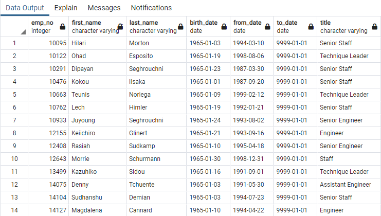

# Pewlett-Hackard-Analysis
## Overview of the analysis

## Results

### Deliverable 1: The Number of Retiring Employees by Title
created retirement_titles table that holds all the titles of employees who were born between January 1,1952 and December 31,1955.As I want to retrieve all records with titles table I used employees table RIGHT JOIN with titles table.I used right join on titles table ,because one employee can have more than one title.

 
     
  retirements_title table:
    
  
  
 -   This table has 133776 records including duplicate values for same employee with different titles. As an example emp_no 4, Chirstian, has two records in the table with 2 titles, one as Enginner and the other as Senior Engineer. In 1986 he was an Engineer and then promoted 1995 as a senior Engineer. So this table includes multiple entries for employes with different titles thet he/she hold since from the begining. 
     
     

Used DISTINCT ON to filter the most recent title of each employee and put them into a new table called unique_titles. Further, exclude the employees those who have already left the company by filtering on "to_date" equal to '9999-01-01'.

 
 
unique_titles table:
 

 - The unique_titles table only contains most recent titiele for current employees those who recently will be retired, the table. has only 72458 records.So we can claerly say in near future 72458 numbers of employees will be retiring.

Finally, wrote a statement to retreive the number of employees by their most recent job titel who are about to retire. Used COUNT() on emp_no and GROUP BY title.
 

    
   retiring_title table:
    

- From looking at this output at glance we can say how many employees going to retire for each title.i.e 25916 Senior Engineers and only 2 Managers going to be retire. According to the table 70% of employees is senior staff going to be retire..

### Deliverable 2: The Employees Eligible for the Mentorship Program

Wrote statement and create a mentorship-eligibility table that holds the current employees who were born between January 1, 1965 and December 31, 1965.
 Used DISTINCT ON statement to retreive the first occurence of the employee number.Filtered the data on the to_date column to all the curent employees by using ,to_date = '9999-01-01'.And filter the data on the birth_date columns to get all the employees whose birth dates are between January 1, 1965 and December 31, 1965.

     
mentoship_eligi table
     

- This table shows detail of mentoship_eligibility employees.and it has count of 1549 records.Now then hierachy of company has to deside is there enough peole in mentoship_eleigibility programme to train new employees?

## Summery
1) How many roles will need to be filled as the "silver tsunami" begins to make an impact?

According to the above results ,72 458 employee positions need to be filled in very near future when silver tsunami begins to impact.

2) Are there enough qualified, retirement-ready employees in the departments to mentor the next generation of Pewlett Hackard employees?

By looking at the number of emloyees ritiring(72,458) and count of mentoship eligibility employees  1549 the ratio is 1:47 that is 1 mentor has to train 47 employees roughly.
so there are not enough retirement ready employees to train next generation of Pewlett Hackard .
